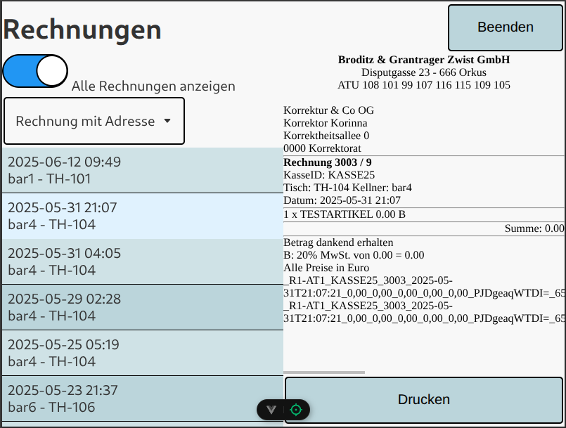
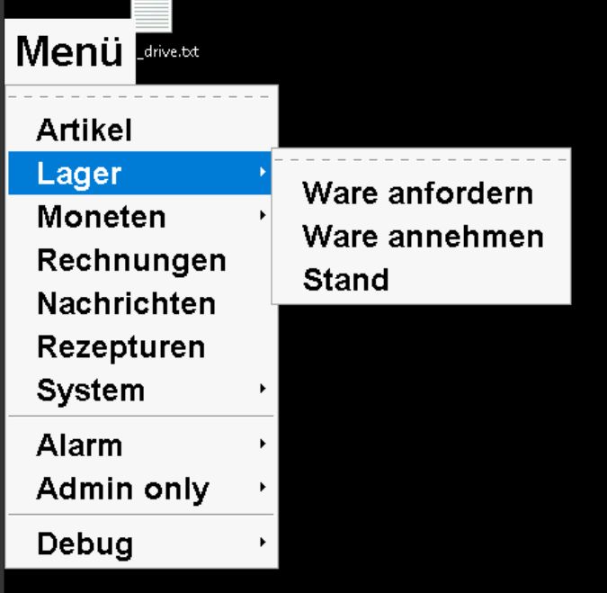
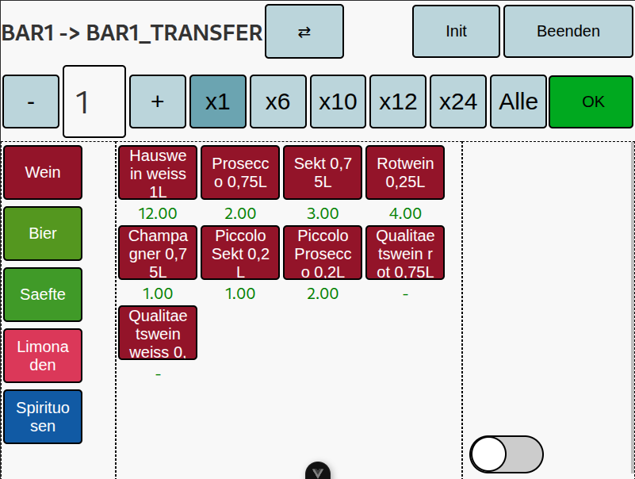

# Wiffzack Additions

Wiffzack Additions is a project designed to enhance the functionality of the [Wiffzack](https://finanzkasse.at) tally counter software. Its primary focus is to make various operational tasks easier, with a significant emphasis on improving storage handling and management processes.

## Web Client (`client/`)

The Web Client is a Vue.js single-page application that provides the primary user interface for Wiffzack Additions. It allows users to interact with the system for tasks such as storage management, viewing data, and accessing various features.

### Installation

1.  **Prerequisites:**
    *   [Node.js and npm](https://nodejs.org/) must be installed.
2.  **Setup:**
    *   Navigate to the `client/` directory.
    *   Install dependencies:
        ```bash
        npm install
        ```
3.  **Configuration:**
    *   The client's primary configuration is for the backend API host.
    *   By default, it uses `http://localhost:5000` as defined in `client/src/config.default.js`.
    *   To override this, create a `config.json` file in the `client/public/` directory (this file will be fetched by the client at runtime). Example `client/public/config.json`:
        ```json
        {
          "backendHost": "http://your-server-ip:5000"
        }
        ```
    *   The client application is typically served by the Wiffzack Additions server component, which also provides the API. Ensure the server is running and accessible from the client's perspective.

### Usage

1.  **Development:**
    *   To run the client in development mode with hot-reloading:
        ```bash
        cd client/
        npm run dev
        ```
    *   Access the client in your web browser, usually at `http://localhost:5173` (Vite's default port) or whatever port `npm run dev` indicates.
2.  **Production:**
    *   To build the client for production:
        ```bash
        cd client/
        npm run build
        ```
    *   This will create a `dist/` directory within `client/`. These static files are intended to be served by the Wiffzack Additions server (or any other web server).
    *   When served by the Wiffzack Additions server, access it via the server's address (e.g., `http://localhost:5000`).
3.  **Specify the Terminals:**
    *   The client interface can be tailored for specific terminals by passing a `terminal` query parameter in the URL. For example: `http://localhost:5000/?terminal=bar1`.
    *   A `destTerminal` parameter can also be used for operations involving two terminals (used for the storage interactions).

## Menu Button (`menu_button/`)

The Menu Button is a small Python application that displays an on-screen menu, providing quick shortcuts to various parts of the Wiffzack Additions web client. It's designed for environments where a simple, persistent menu is needed, often on touchscreen terminals.

### Installation

1.  **Prerequisites:**
    *   Python 3.
    *   Tkinter library (usually included with standard Python installations).
2.  **Configuration:**
    *   The Menu Button loads its configuration from `~/.wiffzack_additions/config.client.toml`.
    *   If this file doesn't exist, you'll need to create it. You can copy `menu_button/config.default.toml` to `~/.wiffzack_additions/config.client.toml` and modify it.
        ```bash
        mkdir -p ~/.wiffzack_additions
        cp menu_button/config.default.toml ~/.wiffzack_additions/config.client.toml
        ```
    *   Edit `~/.wiffzack_additions/config.client.toml` to set:
        *   `name`: The identifier for the client terminal (e.g., "bar1"). This is used in URLs.
        *   `web_server`: The address of the Wiffzack Additions server (e.g., "localhost:5000").
        *   `browser_cmd`: The command to launch a web browser in kiosk mode. The default is configured for Chromium. Adjust this to your installed browser and desired kiosk options.
        *   `debug`: Set to `true` or `false`. Enables a debug menu item if true.

### Usage

1.  Run the script from the project's root directory:
    ```bash
    python menu_button/menu_button.py
    ```
2.  A small, always-on-top menu will appear on the screen.
3.  Clicking menu items will open the corresponding Wiffzack Additions client page in the configured kiosk browser.

## Server (`server/`)

The Server component is the backend for Wiffzack Additions, built with Flask (a Python web framework). It provides a RESTful API for the web client, interacts with the database, handles business logic, and serves the static files for the web client.

### Installation

1.  **Prerequisites:**
    *   Python 3 and `pip` (Python package installer).
2.  **Dependencies:**
    *   Navigate to the `server/` directory.
    *   It's highly recommended to use a Python virtual environment:
        ```bash
        python3 -m venv venv
        source venv/bin/activate  # On Windows: venv\Scripts\activate
        ```
    *   Install required Python packages. Key dependencies include Flask, Flask-CORS, and a database connector (e.g., `pymssql`).
        *A `requirements.txt` file is provided for Python dependencies. Install all required packages with:*
        ```bash
        pip install -r requirements.txt
        ```
        *This will install Flask, Flask-CORS, pymssql, requests, and any other dependencies needed by the server.*
        *(Note: The `wiffzack` and `lib` directories within `server/` contain custom modules used by the application.)*
3.  **Configuration:**
    *   The main configuration file is `server/config.toml`.
    *   Optionally, you can create a user-specific config file at `~/.wiffzack_additions/config.toml` to override or extend the base config. The server will automatically merge this user config with the base config at startup (see `server/lib/config.py`).
    *   Edit your configuration files to set the following sections and keys:
        *   **`[database]`**: Connection parameters for your database (server address, database name, username, password). The configuration is for Microsoft SQL Server.
        *   **`[server]`**:
            *   `host`: Host address for the server to listen on (e.g., "0.0.0.0" for all interfaces, "localhost" for local only).
            *   `port`: Port for the server (e.g., 5000).
            *   `debug`: Set to `true` or `false` to enable/disable Flask debug mode.
            *   `init_stock_directory`: Path to the directory containing CSV files for initial storage inventory setup (relative to the `server/` directory, e.g., "assets/init/").
        *   **`[alarm]`**:
            *   `url`: The URL template for triggering an external alarm system. The `{location}` placeholder will be replaced by the relevant terminal/location ID.
        *   **`[terminal_config]`**: Configuration for different client terminals. Each terminal can have:
            *   `name`: A friendly name for the terminal.
            *   `storage_id`: The primary storage ID associated with this terminal.
            *   `request_storage_id`: Storage ID from which this terminal requests articles.
            *   `transfer_storage_id`: A temporary holding storage ID for transfers initiated from this terminal.
            *   Other terminal-specific settings as needed.
    *   The configuration loader will log which config files are loaded and merged. If the user config is missing or invalid, only the base config will be used.

### Usage

1.  Ensure your database server is running and accessible.
2.  (If using a virtual environment, activate it first).
3.  Navigate to the `server/` directory.
4.  Run the server application:
    ```bash
    python server.py
    ```
5.  The server will start and listen on the host and port configured in `config.toml`.
6.  It serves the API endpoints (e.g., `/api/...`) and, by default, the static files for the web client from `../client/dist/` (relative to `server.py`).

**Note:** By default, this setup uses the Flask development server (via `python server.py`). While this is not recommended for production environments due to performance and security limitations, we use it that way with up to 6 terminals in practice.

### API Endpoints

The server provides various API endpoints for:
*   Fetching articles, sales data, tallied items.
*   Managing storage:
    *   Getting storage contents and article groups.
    *   Updating storage (adding, withdrawing, moving articles).
    *   Emptying storage.
    *   Setting initial inventory from CSV files.
*   Handling invoices: listing, printing (via `print_service.py`), fetching HTML.
*   Managing messages.
*   Fetching recipes.
*   Triggering alarms.
*   Requesting server restart (via a flag file).
*   Fetching configuration for clients.

*(For detailed API endpoint definitions, refer to `docs/API.md` or the route decorators in `server/server.py`.)*


### Print Service (`server/print_service.py`)

*   This script is invoked by the server to handle invoice printing.
*   It takes invoice ID, template name, and output format (ESC/POS or HTML) as input (via stdin when spawned by `server.py`).
*   It uses templates from `server/print_templates/` and outputs to a spool directory (`server/spool/`) for ESC/POS, or directly to stdout for HTML.
*   It requires the `step` template library and a database connection.

## Bluetooth Beacon (`bluetooth_beacon/`)

The Bluetooth Beacon component utilizes an ESP32 microcontroller to provide real-time notifications about article availability in storage. The ESP32 (connected via Bluetooth to a monitoring script) can trigger a physical indicator (e.g., an LED).

### Installation

1.  **Firmware:**
    *   The ESP32 firmware is located in `bluetooth_beacon/src/main.cpp`.
    *   [PlatformIO](https://platformio.org/) is recommended for building and uploading the firmware. Open the `bluetooth_beacon/` directory as a PlatformIO project.
    *   Ensure the ESP32 board is correctly configured in `bluetooth_beacon/platformio.ini`.
2.  **Python Client (`bluetooth_beacon/python_client/bt_storage_watcher.py`):**
    *   This script runs on a computer or device with Bluetooth capabilities (e.g., a Raspberry Pi or a PC).
    *   It requires Python 3 and the `PyBluez` and `requests` libraries. You can install them using pip:
        ```bash
        pip install PyBluez requests
        ```
    *   **Configuration:**
        *   Edit `bluetooth_beacon/python_client/bt_storage_watcher.py`.
        *   Set `ESP32_MAC_ADDRESS` to the MAC address of your programmed ESP32 beacon.
        *   Verify `API_URL` and `CONFIG_URL` point to your Wiffzack Additions server API (specifically the storage and configuration endpoints).

### Usage

1.  Ensure the ESP32 beacon is powered on and has the firmware uploaded.
2.  Run the Python client script:
    ```bash
    python bluetooth_beacon/python_client/bt_storage_watcher.py
    ```
3.  The script will periodically check the configured API endpoint.
4.  If the API indicates that articles are available in the monitored storage location(s), the script sends a Bluetooth signal to the ESP32.
5.  The ESP32, upon receiving the signal, will activate its indicator (e.g., turn on or blink an LED as defined in `main.cpp`). It will also blink the LED if it hasn't received a message from the client for a certain period.

## Component Interaction

The Wiffzack Additions components work together to provide a comprehensive solution:

1.  **Core Interaction:**
    *   The **Web Client** is the main user interface. Users perform actions (e.g., request stock, view sales) in the client.
    *   The **Web Client** sends API requests to the **Server**.
    *   The **Server** processes these requests, interacts with the **Database** (for data storage and retrieval), and sends responses back to the **Web Client**.
    *   The **Server** also serves the static files for the **Web Client**.

2.  **Menu Button:**
    *   The **Menu Button** runs on a client machine and provides quick launch shortcuts.
    *   When a menu item is clicked, it opens a specific URL (pointing to the **Web Client**, served by the **Server**) in a kiosk browser.

3.  **Bluetooth Beacon System:**
    *   The **`bt_storage_watcher.py` script** (part of the `bluetooth_beacon` component) runs independently on a machine with Bluetooth.
    *   It periodically calls an API endpoint on the **Server** to check for the availability of articles in a configured storage location.
    *   If the **Server** indicates articles are available, the script sends a command via Bluetooth to the **ESP32 Beacon**.
    *   The **ESP32 Beacon** then activates a local signal (e.g., an LED) to notify nearby users.

4.  **Print Service:**
    *   When a user requests to print an invoice through the **Web Client**, the request goes to the **Server**.
    *   The **Server** then invokes the **`print_service.py` script**, passing the necessary invoice details.
    *   The **`print_service.py` script** fetches detailed invoice data from the **Database**, formats it using templates, and either generates an ESC/POS file for a printer or HTML output.

## Storage Handling Improvements

A key goal of Wiffzack Additions is to streamline and improve storage management. This is achieved through several integrated features:

*   **Web Client Interface:** The web client provides dedicated interfaces for:
    *   **Requesting Articles:** Terminals (e.g., a bar) can request articles from a central storage location.
    *   **Transferring Articles:** Staff can initiate and track the transfer of articles between different storage locations (e.g., from main stock to a bar's local storage). This often involves an intermediate "transfer storage" to confirm receipt.
    *   **Receiving Articles:** Confirming the receipt of requested or transferred articles, which updates stock levels accordingly.
    *   **Viewing Stock:** Users can view current stock levels for different storage locations and article groups.
    *   **Initial Stock Setup:** The system allows for setting initial inventory levels for a storage location by uploading a CSV file (processed by the server).
*   **Bluetooth Beacon Notifications:** The `bluetooth_beacon` system provides physical notifications (e.g., an LED signal) when articles requested by a terminal are marked as ready or available in the designated pickup/transfer storage, reducing the need for manual checks.
*   **Logging:** Storage transfers and updates are logged, providing a trail of inventory movements (see `storage_transfer` logger in the server).

These features aim to provide better visibility into inventory, simplify the process of moving stock between locations, and ensure that terminals have the articles they need in a timely manner.

# Screenshots



*Invoice list and details view*



*On-screen menu for quick navigation*



*Storage management interface*

